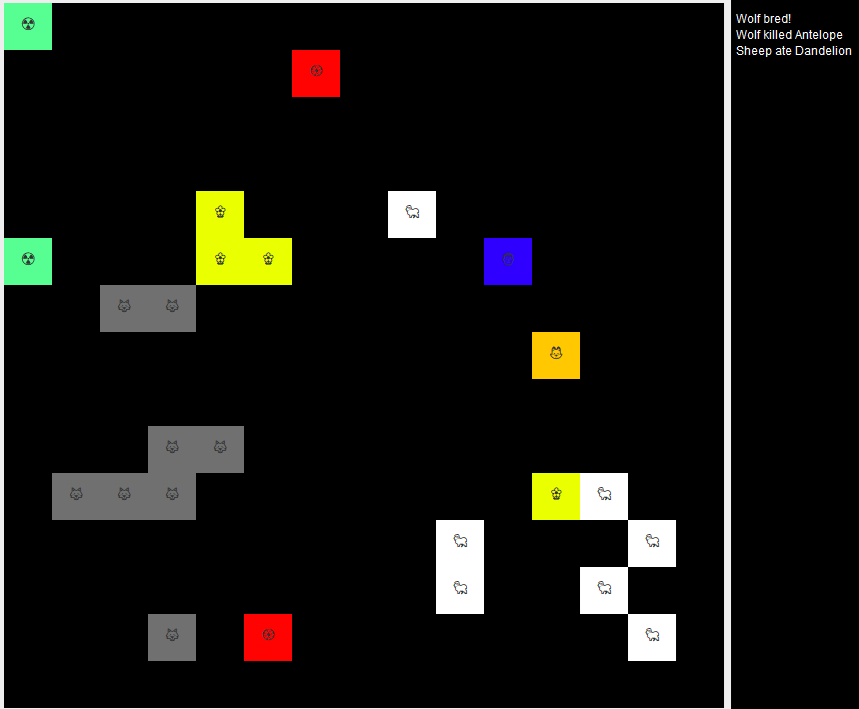

# Java World Simulation



This project is a Java-based simulation of a virtual world. The simulation includes various entities that interact with each other and the environment.

## Features

- **Entities**: Different types of entities such as animals, plants, and humans.
- **Environment**: A dynamic environment that changes over time.
- **Interactions**: Entities can interact with each other and the environment.
- **Simulation Control**: Control the human movement in the enviroment.

## Getting Started

### Installation

1. Clone the repository:
    ```sh
    git clone https://github.com/AdrianSzwaczyk/java-world-simulation.git
    ```
2. Build the project using Java source files.
3. Launch the project.

## Usage

- **Arrow Keys**: Move the human character.
- **R**: Activate the human's special ability (if available).
- **N**: Start a new game.
- **S**: Save the current game state to a file.
- **O**: Load a game state from a file.
- **Escape**: Exit the game.

## Organisms

### Animals

- **Antelope**: Fast and agile, with a chance to escape when attacked.
- **Fox**: Smart predator that avoids stronger animals.
- **Sheep**: Common prey with moderate strength.
- **Turtle**: Slow but has a strong defense mechanism against weaker attackers.
- **Wolf**: Strong predator with high strength.
- **Human**: Player-controlled character with special abilities and cooldowns.

### Plants

- **Dandelion**: Spreads quickly across the board.
- **Grass**: Basic plant that spreads slowly.
- **Guarana**: Boosts the strength of the animal that eats it.
- **Nightshade**: Poisonous plant that kills animals that try to eat it.
- **SosnowskysHogweed**: Dangerous plant that kills nearby animals.
